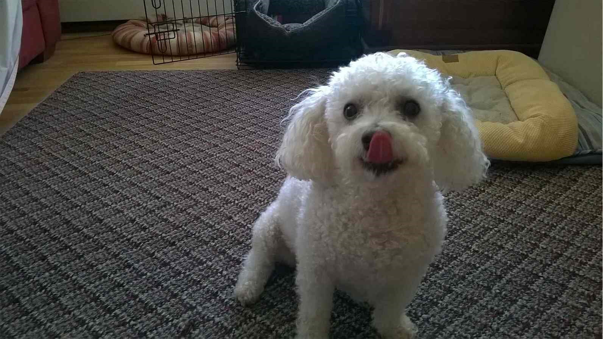

* I made this website for the Data Science I course at Columbia using R programming language.
* I'm based in the New York City area.
* Check out what books I've been reading on [goodreads](https://www.goodreads.com/user/show/90893623-lexi). 

